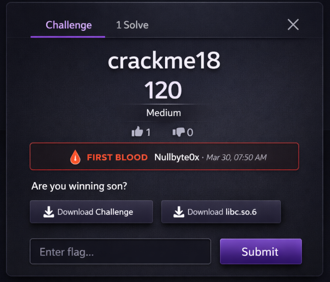

# CTFd-first-blood-display

Shows who got first blood on every challenge. That's it.


## Install

```
cp -r CTFd-first-blood-display  CTFd/plugins/
```

Restart CTFd.

## What happens

Open any solved challenge → 🩸 badge appears with the first solver's name and timestamp.

Works with all challenge types. Works in users mode and teams mode.


## Docker

```
docker cp CTFd-first-blood-display CONTAINER:/opt/CTFd/CTFd/plugins/
docker restart CONTAINER
```

## License

MIT
